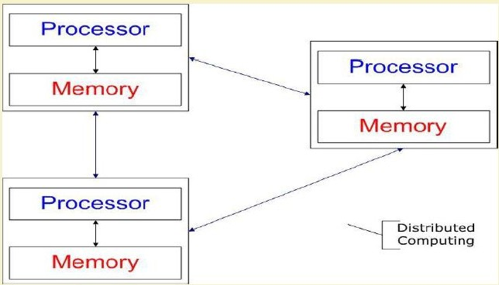
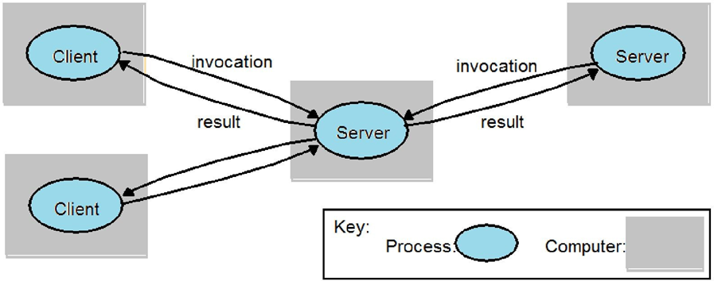
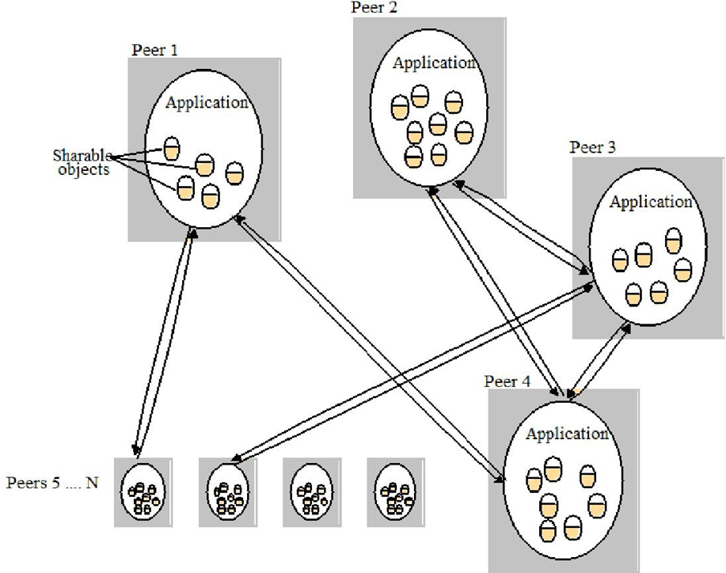
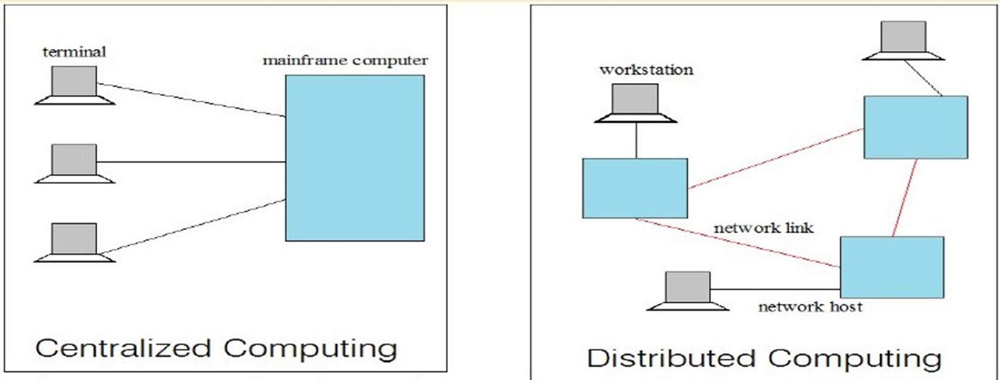
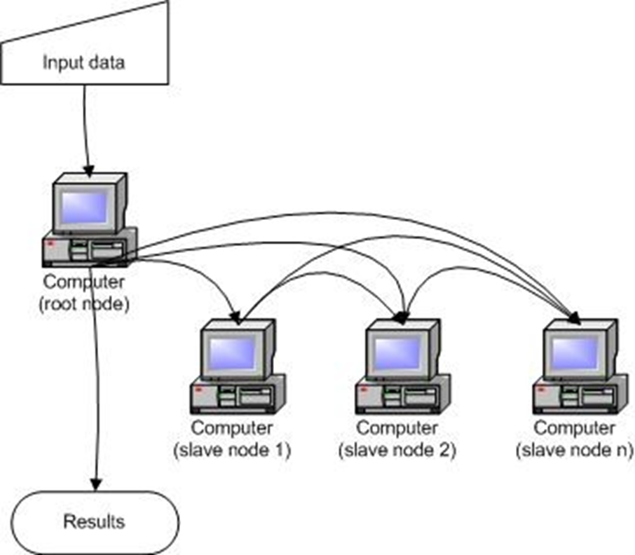

# Introduction to Parallel and Distributed Computing
# Computing:
Any activity that uses computers to manage, process, and share information.  
Real-Life-Example:
- Managing: Organizing your photos in folders
- Processing: Editing a video
- Communicating: Sending an email

# Trends of Computing

# Distributed Computing:

- A group of computers working together that looks like One computer to the user.
- Several independent computers, each with its own memory, communicating by passing messages.
- Analogy: Think of a restaurant chain like Domino's. You order online, and the system finds the nearest store to make your pizza. You don't know or care which store made it - it just works!  
- Operating System Concept: The processors communicate with  one another through various communication lines,such as high-speed buses or telephone lines.
Each processor has its own local memory.

# Computers in a Distributed System
Workstations: End-users use these for daily work(Computer labs).  
- Server Systems: Provide resources and services(College server storing student records).
- Personal Assistance Devices: Handheld computers connected wirelessly(smartphoe accessing college wifi).

# Examples of Distributed System  
- Internet: Millions of computers connected worldwide.
ATM Machines
- intranets: Company's internal network with shared printers and files

# Common Properties of Distributed Computing
**Fault Tolerance:** System keeps working even if some computers fail.  
- if one ATM stops working, other ATMs still work.
- Each Node Plays Partial Role: Each computer knows only single part of the system.
    - In railway reservation, one server handles North India, another handles South India.
- Resource sharing: Users can share computing power and storage.
    - Lab students sharing a powerful printer.
load Sharing: Work is spread across all computers.
    - During exam results, traffic is spread accross multiple servers.
- Easy to Expand: Adding new computers taking little time.
    - Adding more servers during admission season.
- Performance: Work gets done faster with many computers.
    - Downloading a movie from multiple sources simultaneously.
# Why Distributed Computing:
1.nature of Application: Some problems are naturally spread out.  
Example: Banking system with branches everywhere  
Example: Social media where users are worldwide  
2.Performance:
- Computing Intensive: Tasks that need lots of calculation.  
Example: calculating Pi value to billions of digits.  
- Data Intensive: Tasks dealing with huge files.  
Example:Facebook processing millions of photos.  
3.Robustness (Reliability):
- No Single Point of Failure (SPOF): If one computer fails, the system still works
- Task Reassignment: Other computers can take over the failed computer's work  
Real Example: If one Google server fails, you still can search because other servers take over.
# Distributed Applications
Two Main Types:

1.Client-Server (Traditional):
- Server manages resources centrally
- Clients request services
Example: College website - central server, many students access it.

2.Peer-to-Peer (Modern):

- All computers are equal
- More "truly" distributed
Example: Torrent downloads - you download from many users simultaneously.

# Centralized vs Distributed Computing
1. Centralized Computing  
Definition:Centralized computing is a computing model where all processing, data storage, and control are handled by one central computer (usually a mainframe server).
All other devices connected to it act as terminals or clients and depend on the central system to perform tasks.  
In this system, the central computer performs all major operations such as:  

- data processing
- storage
- application execution
- system management  

The terminals simply send requests and receive results.

**How it Works**

- Users connect to a central mainframe computer.
- The central computer processes all tasks.
- Results are sent back to the users.

In the diagram you provided, multiple terminals are connected to one mainframe computer, which performs all the processing.  
Example  
Older banking systems used centralized computing where all branch computers were connected to one central server that processed transactions.  

Another simple example is a school computer lab connected to one powerful server that controls applications and storage.  

Advantages  

- easier to manage
- better security control
- centralized data storage

Disadvantages

- single point of failure
- performance bottleneck if many users connect
- limited scalability

2.Distributed Computing  
Definition:Distributed computing is a computing model where multiple computers (nodes) work together over a network to perform tasks.  
Instead of relying on one central computer, the workload is shared among many machines.  

Each computer in the network can:

- process data
- store information
- communicate with other computers

**How it Works**

- Multiple computers are connected through a network link.
- Tasks are divided into smaller parts.
- Each computer processes its part of the task.
- Results are combined to produce the final output.

In the diagram, several workstations and network hosts are connected and share tasks.

Example

Modern internet services like Google use distributed computing. When you search something, thousands of servers work together to return results quickly.

Another example is cloud computing systems where many servers process user requests simultaneously.

Advantages

- faster processing
- better scalability
- no single point of failure
- efficient resource utilization

Disadvantages

- more complex system design
- network dependency
- harder to manage

# Cluster Computing:

A group of SAME-TYPE of computers in ONE ROOM, connected with FAST cables, working as ONE SYSTEM.
- Like 20 identical chefs working in one kitchen, all wearning same uniform, using same ingredients, following same head chef.  

# Key Components of Cloud Computing:

- Multiple Standalone Computers: Regular computers, each can work alone.
- Operating System: usually same OS on all(all linux or all windows).
- High-Performance Interconnects: Very fast cables connecting them.
- Middleware: Software that makes them work together.
- Parallel Programming Environments: Tools to writr programs that use all computers.
- Applications: The actual work being done.

# Cluster Characteristics:

- Network: Faster than regular LAN(Local Area Network)
- Communication: Very fast, low delay(low latency)
- Coupling: Loosely coupled(not as tight as multi-core processors)  

# Types of Clusters

1. High Availability (Failover) Clusters
- Purpose: Keep services running even if some computers fail.  
Real-life Example:
- Airline reservation system
- If one server fails, another takes over immediately
- Passengers keep booking tickets without noticing any problem  
2.Load Balancing Clusters  
- Purpose: Spread work evenly across all computers   
Real Example:
- Flipkart during Big Billion Day sale
- Millions of users are distributed across many servers
- No single server gets overloaded  
3.Parallel/Distributed Processing Clusters  
- Purpose: Solve big problems by dividing work.  
Real Example:  
- Weather forecasting
- Each computer calculates weather for one region
- All results combined for full forecast

# Benifits of Clusters:

- System Availability: Redundant hardware and software.
    - Multiple servers, if one fails, others work.
- Hardware Fault Tolerance: Backup for disks, power supplies.
    - RAID disks-if one disk fails, data safe on others.
- OS & App Reliability: Multiple copies running.
    - Same application on multiple servers.
- Scalability: Add more servers as needed.
    - Add more servers when student enrollment increases.
- High Performance: many computers working together.
    - Research simulations finish faster.

# Grid Computing:
Connecting different types of computers from different places to create ONE BIG VIRTUAL COMPUTER.  
- Like different countries contributing resources to build a space station-each country brings different expertise and equipment, all working together for one goal.  

# Need of Grid Computing:

- Modern Science: Research needs massive computations, data analysis.
- Cost-Effective: Computer simulations cheaper than physical experiments.
- Complex Problems: Need more accurate solutions quickly.
- Data Visualization: Important for understanding results.
- Resource Utilization: use idle computers productivity.

# Applications of Grid Computing:

- Weather Forecast: Combines data from satellites, ground stations, ocean buoys worldwide.
- Natural Disaster Detection: Earthquake prediction using seismic data from thousands of sensors.
- Physics Application: LHC (Large Hadron Collider) data processed across 42 countries.
- Drug Research:Simulate molecule interactions using computers worldwide.

# Types of Grids:

1.Computational Grid:
Processing power for HTC(High Throughput) and HPC(High Performance)
. SETI@Home-using idle home computers to search for aliens.
2.Data Grid:
Data Storage, discovery, handling, publication of Large Volumes.
- Biomedical research sharing genomic databases globally.
3. Collaboration Grid: 
- Better collaboration over internet.
- Global climate researchers working together.
4.Network Grid:
Fault-tolerant, high-performance communication.
- National research networks connecting supercomputers.
5.Utility Grid:
Ultimate form-sharing ANY resource.
- Software, computing cycles,data,everything shared.

# Utility Computing:
- Pay for Computing like you pay for electricity- only for what you use.
- Utility Computing is the concept, cloud computing is the practical implementation.
.Like your electricity bill- you pay for the units you consume, not a fixed amount regardless of usage.

# Key Features:

- pay-Per-Use Pricing: Pay only for what you consume.
- Data Center Visualization: Efficient use of resources.
- Resource Utilization: Solve problem of idle resources.
- Outsourcing: Let experts manage infrastructure.
- Web Services Delivery: Access services over internet.

# Payment Models:

- Same range of charging models as other utility providers: gas,electricity, telecommunications, water, television broadcasting.
- Flat Rate:Fixed price regardless of usage.
    - Netflix monthly subscription
- Subscription:Regular payment for ongoing access.
    - Microsoft 365 yearly payment
- Metered:Pay based on measured usage.
    - AWS-pay per hour of server use.
- Pay-as-You-go:Flexible, pay only when you use.
    - Prepaid mobile recharges.

# Pricing Factors

- Scale (how much you use)
- Commitment (long-term vs short-term)
- Payment frequency (monthly, yearly, etc.)

# Distributed vs Grid vs Cluster vs Utility

- Distributed Computing is managing or pooling the hundreds or thousands of computer systems to solve a large computational problem.
- Grid computing has some extra characteristics. Efficiently utilization of a pool of  heterogeneous systems; more wide scale and geographically distributed.
- Cluster computing consists of  homogenous hardware and OS; geographically connected by LAN
- Utility computing is a service provisioning model; computing resources available for consumers as needed.